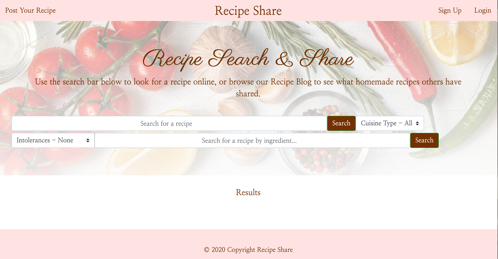
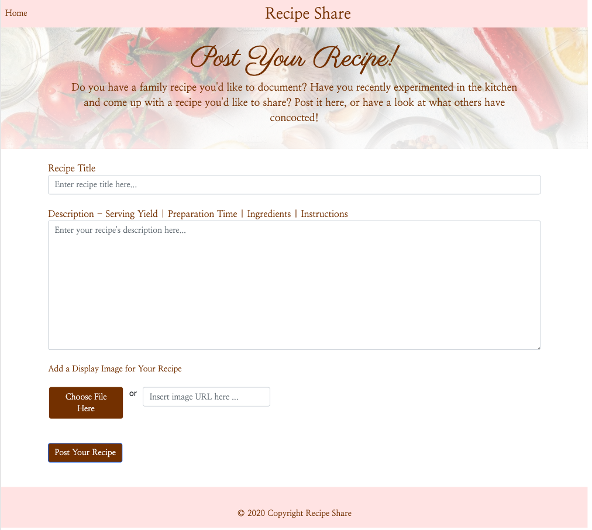
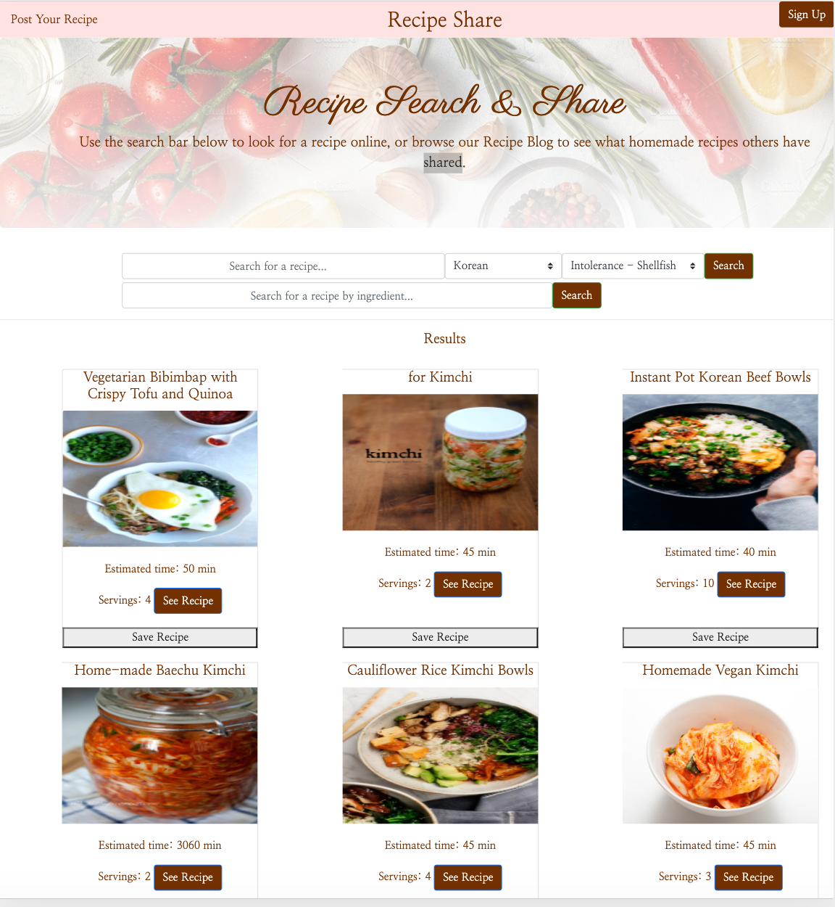

## Description
Recipe Share is an application where users can search for, and share their own recipes on a single platform. When users create an account, they will have the option to “save” recipes for later and add their own concoctions to the food blog.

## Installation
You need to create the database and setup the .env to run this. 
You may also need to do an npm install

### Create Database
Use Mysql Workbench and copy schema.sql and seed.sql and run each document in it.

### Configure .env
Create/use the .env file and put in these elements
DB_NAME=(db-name)
DB_USER=(db-user)
DB_PWD=(db-password)

## Run Locally
node server.js

open browser to http://localhost:3000

## Links:
* Deployed at: https://recipe-share-team-one.herokuapp.com/
* Presentation slides: https://docs.google.com/presentation/d/1mzwqSG5l1ccwJvd59UCrqDW_1Mcoga7kNdNsRl2DfMc/edit#slide=id.ga6d2717754_2_99
## Screenshots:
* Home Page: 
* Post Recipe Page: 
* Search results: 
## Stylistic Notes
This code has been written towards keeping it clean and simple, yet self-explanatory.

It has also been written in a style to sheppard us into the style used in React, 
hence the onClick listeners embedded in the HTML.

We try to use ES6 async functions for clean handling of asyncronous functions.

We serve RESTful API calls on the backend, as is good modern programming practice.

Finally we illustrate how npm packages can be used on the server and client side (moment.js)
